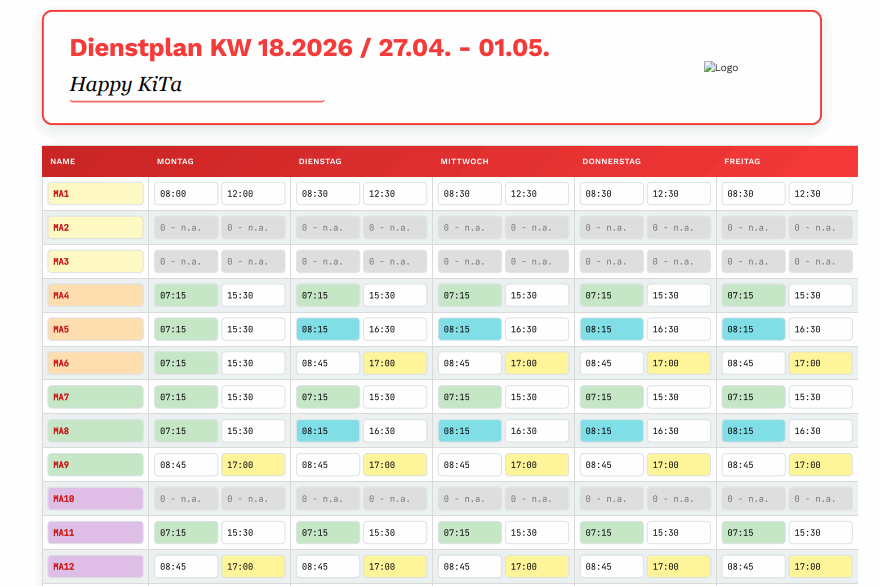

# Dienstplan

Digitaler Dienstplan -- Dieser Dienstplan ist eine **lokale Anwendung**, die direkt in Deinem Internetbrowser (z. B. Chrome, Edge, Firefox usw.) läuft. 
DU benötigst keine spezielle Software, **keine Installation** und **keine Internetverbindung**. 
Alle eingegebenen **Daten bleiben ausschließlich auf Deinem eigenen Computer**.
     

 
 
## Starten

1. Speichere die Datei „Dienstplan” in einem Ordner.
2. Dein Logo: Speichere im selben Ordner Dein KiTa-Logo als "logo_icon.png": So wird es oben rechts erscheinen.
3. Öffne die HTML-Datei mit einem einfachen Doppelklick.

## Personal eintragen
Klicke auf „Mitarbeiter hinzufügen“. Trage die Namen ein und wähle die Funktionen, Gruppen und Dienstzeiten über die Drop-Down-Menüs aus. 

<video src="https://github.com/user-attachments/assets/ca629639-8d85-4ba5-9659-2ce49bcafcb5" 
       muted 
       autoplay 
       loop 
       playsinline 
       style="max-width: 100%;">
</video>
 
## Pfeiltaste nutzen
Mit einem Klick auf die Pfeiltaste zwischen den Tagen überträgst Du den Dienst vom jeweiligen Vortag.

## Zahnradsymbol (Tagesansicht)
Dieses Symbol findest Du zwischen den Arbeitszeiten eines Tages. Nutze es, um die Soll-Zeiten individuell anzupassen.

## Zeitleiste 
Im unteren Bereich findest Du eine grafische Tagesansicht. Dort kannst Du Deine Schichten visuell überprüfen und sie direkt mit der Maus anpassen. 
<video src="https://github.com/user-attachments/assets/97d96c70-1a9e-4bb5-b02e-1342f05641f8"
       muted 
       autoplay 
       loop 
       playsinline 
       style="max-width: 100%;">
</video>
 
## Einstellungen anpassen
Über das Zahnrad-Symbol oben rechts gelangst Du zu den Einstellungen. Hier kannst Du feste Dienstzeiten, Gruppennamen und die Farben für Deine Einrichtung definieren.

## Datensicherung
Nutze die Speichern-Knöpfe, um deinen aktuellen Stand als Datei auf dem Computer zu sichern. Über „Woche Importieren“ kannst Du diese Dateien später jederzeit wiederherstellen. 
Und zwar:
* Daten exportieren & importieren  
Nutze die Export-Funktion, um Deinen Plan als .json-Datei herunterzuladen. Über die Import-Funktion kannst Du diese Datei später wieder importieren, um den Stand wiederherzustellen und dann neue Wochen generieren.
* Speichern  
Verwende die Speichern-Funktion, um Deine Ansicht als .html-Datei lokal zu sichern. So kannst du den Plan im Browser wieder mit Deinen eingetragenen Daten öffnen.

## Drucken
Ein Klick auf „Ausdrucken“ genügt. Der Plan blendet automatisch alle unnötigen Bedienelemente aus und formatiert die Tabelle passend für das Papierformat.

### Hinweis: 
Alle Symbole in der Datei dienen nicht der Dekoration, sondern sind funktionale Buttons. 
### Viel Spaß beim Spielen!

Hat es Dir gefallen? 
**Gerne buy me a coffee:** 

